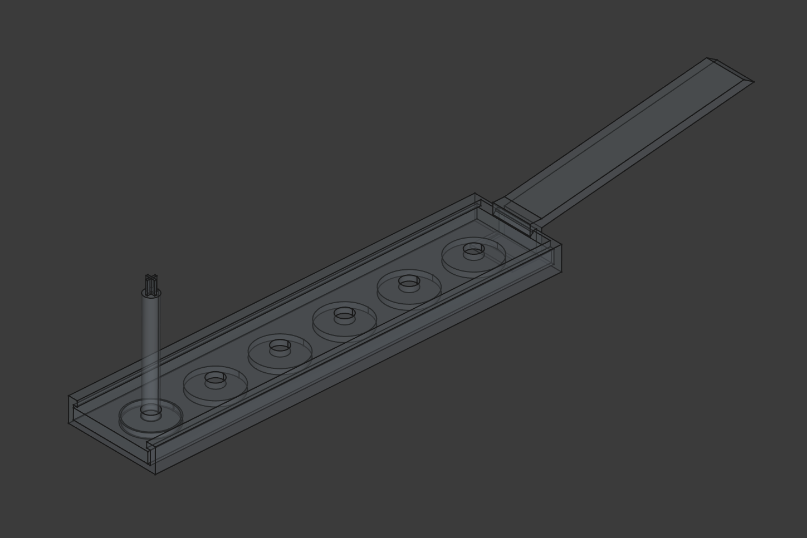
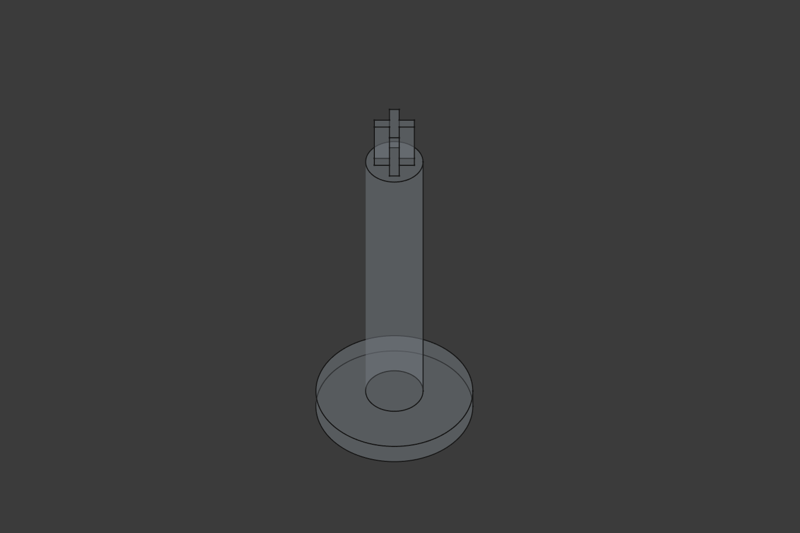
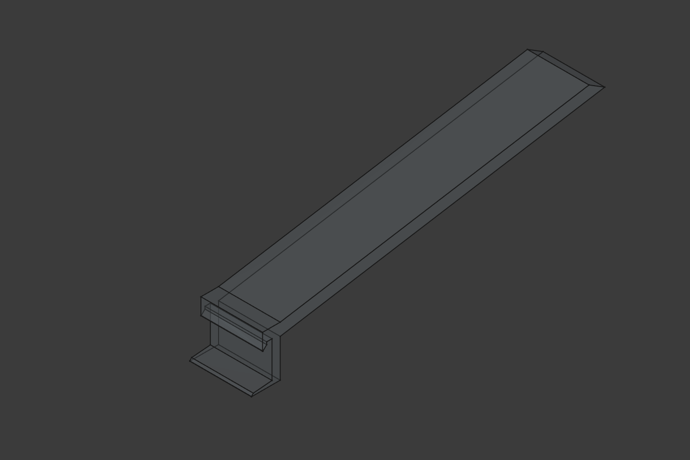
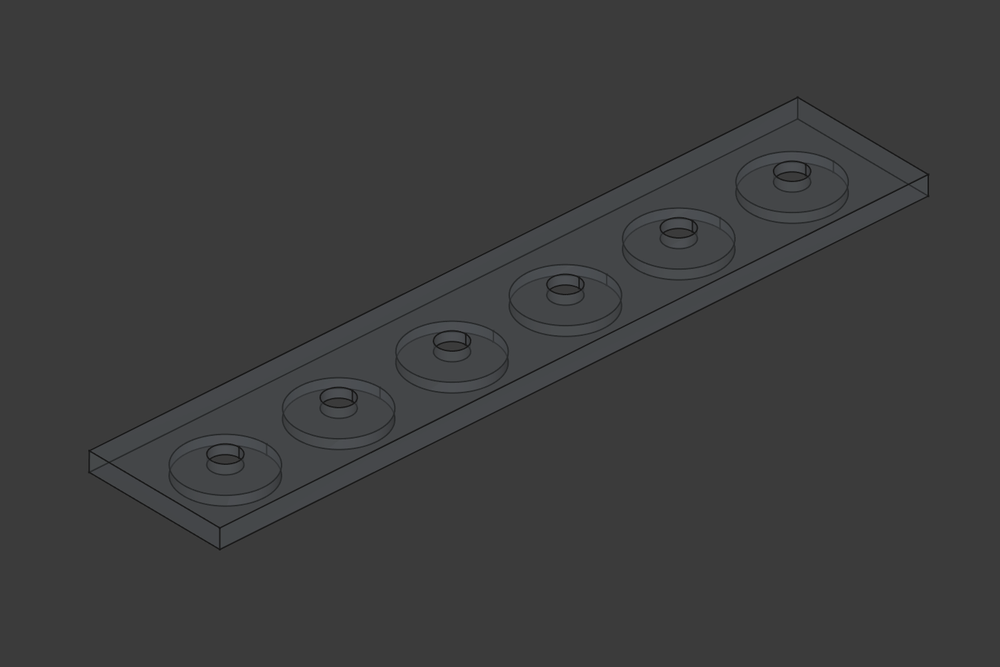
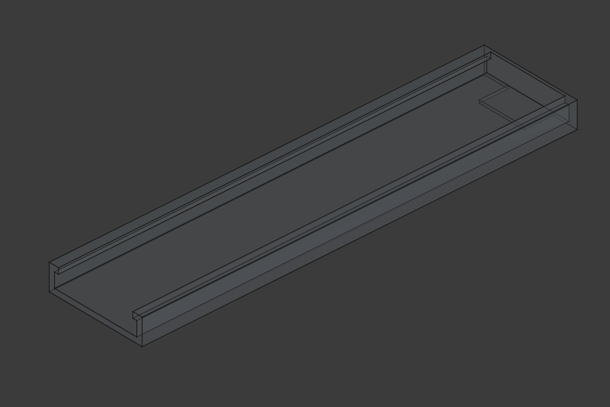

# Keycap paint stand

This is a 3D printable stand ment to be used to hold keycaps when painting.

It consists of four parts,
- Keycap stand with a cherry mx cross on the top.
- Plate with holes that holds the stands in place.
- Tray that slides under the plate to hold everything together.
- A detachable handle

The design makes it possible to rotate the keycaps to reach all sides and the
handle can be attached and detached using one hand so regardless of how many
stands you print you will only need one handle

The keyboard and keycaps in the images were also designed by me and can be found
here: [keyboard](https://github.com/erikpeyronson/ermbkbd) and
[keycaps](https://github.com/erikpeyronson/eskc)

It was designed using [freecad](https://www.freecad.org/)

# Images

## In action

## Model

